<p align="center">
  
</p>

<p align="center">
  
</p>

<p align="center">
  
</p>

<p align="center">
  
</p>

<p align="center">
  
  
  
  
</p>

## Professional Profile

```txt
alias       thedevilhunter225
location    Islamabad, Pakistan
education   BS Cyber Security - 6th semester
focus       SIEM monitoring, threat intelligence, CTF labs, detection engineering
objective   build practical security tools and produce clear, evidence-based analysis
```

<p align="center">
  
</p>

## Technical Stack

<p align="center">
  
</p>

```txt
Detection      Elastic Security, Kibana, Elastic Agent, SIEM triage
Labs           Nmap, Kali Linux, VirtualBox, VMware, controlled lab networks
Intelligence   VirusTotal, urlscan.io, AlienVault OTX, DNS/RDAP enrichment
Development    FastAPI, SQLite, automation scripts, report generation
```

## Featured Projects

<table>
  <tr>
    <td width="50%">
      <h3>PhishGuard CTI</h3>
      <p>Threat intelligence analyzer for suspicious URLs and domains with explainable risk scoring, IOC extraction, enrichment, sandbox evidence, and report exports.</p>
      <p><b>Focus:</b> phishing analysis, enrichment workflows, and evidence-backed reporting.</p>
    </td>
    <td width="50%">
      <h3>Elastic Stack SIEM Lab</h3>
      <p>Home lab for endpoint log collection, Elastic Security monitoring, Nmap activity simulation, dashboards, and alerting workflows.</p>
      <p><b>Focus:</b> detection engineering, alert triage, and practical monitoring workflows.</p>
    </td>
  </tr>
</table>

## Achievements

```txt
PakCrypt / PCC Finalist 2025
AirOverflow ARENA Rank #1
TechJam 2026 CTF - 1st Position
SUDO Fuzzers CTF - 1st Position
NUST Hackathon 2026 - 3rd Position
```

<p align="center">
  
</p>

## Activity Dashboard

<p align="center">
  
</p>

<p align="center">
  
</p>

<p align="center">
  
</p>

<p align="center">
  <b>Focused on practical cybersecurity, clear evidence, and continuous improvement.</b>
</p>
